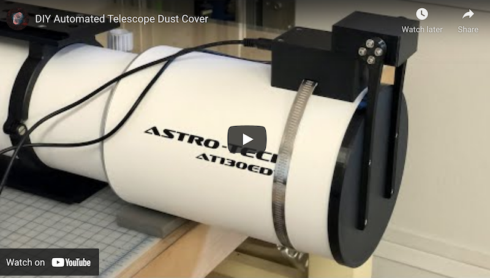
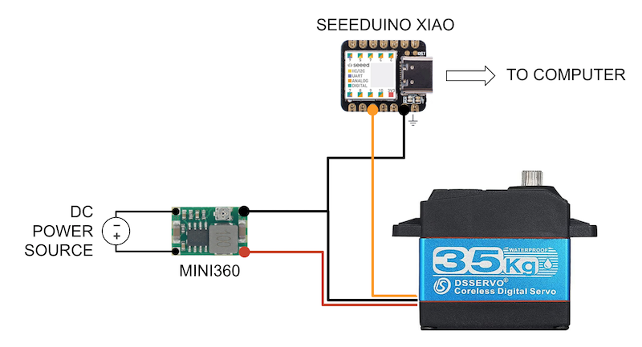
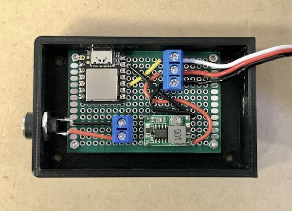

# ASCOM-Compatible Telescope Cover

I do not charge anything to create and maintain these open-source projects. But if you would like to say "thanks" for this project, feel free to send any amount through Paypal using the button below. I appreciate your support!

[](https://www.paypal.com/donate/?hosted_button_id=49UXY8F6VVYFA)

:warning: **IMPORTANT:** :warning: This project is no longer actively maintained. Instead, check out [my new Telescope Cover V2](https://github.com/jlecomte/ascom-telescope-cover-v2).

<!-- toc -->

- [Introduction](#introduction)
- [Pre-Requisites](#pre-requisites)
- [Hardware](#hardware)
- [ASCOM Driver](#ascom-driver)
  - [Downloading And Installing The Driver](#downloading-and-installing-the-driver)
  - [Compiling The Driver (For Developers Only)](#compiling-the-driver-for-developers-only)
- [Arduino Firmware](#arduino-firmware)
  - [Microcontroller Compatibility](#microcontroller-compatibility)
  - [Compiling And Uploading The Firmware](#compiling-and-uploading-the-firmware)
- [Mechanical Components](#mechanical-components)
- [Electronic Circuit](#electronic-circuit)
- [Ideas For Future Improvements](#ideas-for-future-improvements)

<!-- tocstop -->

## Introduction

This repository contains code that allows you to build your own automated telescope cover. Here is a short demo video of the finished product, hosted on YouTube. Check it out!

[](https://www.youtube.com/watch?v=h6WpVCcGNUw)

In this repository, you will find:

* The code for the ASCOM driver (Microsoft Visual Studio 2022 project)
* The code for the Arduino firmware
* The various STL files to 3D print all the mechanical parts
* A blueprint for the electronic circuit

## Pre-Requisites

* A Windows computer (Windows 10 or newer)
* [Microsoft Visual Studio](https://visualstudio.microsoft.com/) (FYI, I used the 2022 edition...)
* [ASCOM Platform](https://ascom-standards.org/)
* [ASCOM Platform Developer Components](https://ascom-standards.org/COMDeveloper/Index.htm)
* [Arduino IDE](https://www.arduino.cc/en/software)
* [FreeCAD](https://www.freecadweb.org/), a free and open-source 3D parametric modeler
* A 3D printer able to print PETG, and a slicer (I use a heavily upgraded Creality Ender 3 v2, and Ultimaker Cura)
* A few basic tools that any tinkerer must own, such as a breadboard, a soldering iron, etc.

## Hardware

The following are just suggestions... Also, over time, some of the Amazon links may no longer work...

* [Seeeduino XIAO](https://www.seeedstudio.com/Seeeduino-XIAO-Arduino-Microcontroller-SAMD21-Cortex-M0+-p-4426.html) (You can get it quicker from Amazon, but you will have to pay twice as much!)
* [Mini360 Buck Converters](https://www.amazon.com/dp/B07T7L51ZW?tag=darkskygeek-20)
* [Perforated Circuit Board (PCB)](https://www.amazon.com/dp/B07NM68FXK?tag=darkskygeek-20)
* [DC Power Jack](https://www.amazon.com/dp/B01N8VV78D?tag=darkskygeek-20)
* [High torque quality Servo with 270° control angle](https://www.amazon.com/dp/B07S9XZYN2?tag=darkskygeek-20)
* [Aluminum Servo Horn](https://www.amazon.com/dp/B07D56FVK5?tag=darkskygeek-20)
* [Bench Power Supply](https://www.amazon.com/dp/B07GCJ5QHF?tag=darkskygeek-20)
* [Threaded inserts for 3D printed parts](https://www.amazon.com/dp/B07VFZWWXY?tag=darkskygeek-20)
* [Assortment of small metric screws, nuts, and washers](https://www.amazon.com/dp/B08JCKH31Q?tag=darkskygeek-20)
* [22AWG solid core electrical wires](https://www.amazon.com/dp/B088KQFHV7?tag=darkskygeek-20)
* [Easy-to-print PETG filament](https://www.amazon.com/dp/B07PGYHYV8?tag=darkskygeek-20)
* [Stainless steel cut-to-length hose clamp](https://www.amazon.com/dp/product/B08Y6LSL3R?tag=darkskygeek-20)

## ASCOM Driver

### Downloading And Installing The Driver

**Step 1:** Download the driver from the [releases page](https://github.com/jlecomte/ascom-telescope-cover/releases), and place the file `ASCOM.DarkSkyGeek.TelescopeCover.dll` somewhere on your system (example: `C:\Users\julien\ascom-telescope-cover\`).

**Step 2:** Open a command prompt, but make sure you run it **as an administrator**!

**Step 3:** Then, proceed with the installation of the driver using `RegAsm.exe`, a utility that should already be present on your system (it comes with the .NET framework). Just don't forget to use the 64 bit version, and to pass the `/tlb /codebase` flags. Here is what it looked like on my imaging mini computer:

```
> cd C:\Users\julien\ascom-telescope-cover\
> C:\Windows\Microsoft.NET\Framework64\v4.0.30319\RegAsm.exe /tlb /codebase ASCOM.DarkSkyGeek.TelescopeCover.dll
Microsoft .NET Framework Assembly Registration Utility version 4.8.4161.0
for Microsoft .NET Framework version 4.8.4161.0
Copyright (C) Microsoft Corporation.  All rights reserved.

Types registered successfully
```

**Note:** The output may be more verbose than the above. As long as it says `Types registered successfully`, you are good to go!

**Note:** During registration, you will see a warning that the assembly is unsigned. This is normal as I did not bother going through the pain of signing the assembly, so you will just have to trust that you are registering the DLL that I built and uploaded to GitHub. And if you don't trust me / GitHub, you can build the DLL yourself using Visual Studio.

**Note:** Once the driver has been installed, make sure you do _not_ delete or move the `ASCOM.DarkSkyGeek.TelescopeCover.dll` file, or things will not work! (if you do move it, you will need to register it again in its new location)

**Step 4:** Start (or restart, if it was already running) N.I.N.A. (or whatever application you use to control your equipment).

### Compiling The Driver (For Developers Only)

Open Microsoft Visual Studio as an administrator (right click on the Microsoft Visual Studio shortcut, and select "Run as administrator") This is required because when building the code, by default, Microsoft Visual Studio will register the necessary COM components, and this operation requires special privileges (Note: This is something you can disable in the project settings...) Then, open the solution (`ASCOM_Driver\ASCOM.DarkSkyGeek.TelescopeCover.sln`), change the solution configuration to `Release` (in the toolbar), open the `Build` menu and click on `Build Solution`. As long as you have properly installed all the required dependencies, the build should succeed and the ASCOM driver will be registered on your system. The binary file generated will be `ASCOM_Driver\bin\Release\ASCOM.DarkSkyGeek.TelescopeCover.dll`. You may also download this file from the [Releases page](https://github.com/jlecomte/ascom-telescope-cover/releases).

## Arduino Firmware

### Microcontroller Compatibility

Pretty much all Arduino-compatible boards should work. There is nothing magical about the firmware. However, see the comment regarding the pins and the servo library. Depending on the exact board you picked, you might have to change that.

### Compiling And Uploading The Firmware

* Add support for Seeeduino boards by following [the instructions from the board manufacturer](https://wiki.seeedstudio.com/Seeeduino-XIAO/).
* To customize the name of the device when connected to your computer, open the file `boards.txt`, which, on my system and for the version of the Seeeduino board I am using, is located at `%LOCALAPPDATA%\Arduino15\packages\Seeeduino\hardware\samd\1.8.2\boards.txt`. Then, change the value of the key `seeed_XIAO_m0.build.usb_product` from `Seeed XIAO M0` (default) to whatever you'd like.
* Finally, connect your Seeeduino board to your computer (make sure you use a USB-C cable that supports data and not just power!), open the sketch file located at `Arduino_Firmware\Arduino_Firmware.ino`, and click on the `Upload` button in the toolbar.

## Mechanical Components

Here is a 3D rendering of all the parts involved in this project:


The STL files you will find in the `3D_Files/` folder are just a starting point. You will likely have to create your own version of this project, if only to match the base curvature to your own OTA... That is why I included the FreeCAD file in this repository! (also in the `3D_Files/` folder)

## Electronic Circuit



Here is what the electronic circuit looks like:



In the photograph above, the components were soldered onto a 60mm x 40mm PCB.

## Ideas For Future Improvements

* Remove the need for a separate 12V power connector, i.e. use the USB cable for both data and power. This change would prevent us from using an Arduino-compatible board because the maximum current that can be delivered by an Arduino-compatible board is usually around 200mA, which is not enough for a powerful servo. In order to do this, you'd have to basically build your own Arduino board using a micro-controller, a USB jack, a USB driver, and many other components... It's quite a project on its own, which is why I decided to go the "easy" route... Alternatively, I found a unit called "PD Micro" which implements USB-C power delivery. I have not tried it yet, but it looks promising.
* Automatically sense the position of the cover before powering up the servo. Right now, if you power up the unit while the cover is open, it will suddenly close very quickly. That can be quite a jarring experience the first time you see it happen. And if something is in the way (example: a flat panel), you could potentially damage your equipment. This could be solved with a simple potentiometer attached to the servo arm.
* Integrate a flat field panel inside the cover. I wanted to keep this project relatively simple, and I did not want to add any more weight to the front end of my already front heavy refractor, so I skipped that, but it can be done and would be a great addition to this project!
